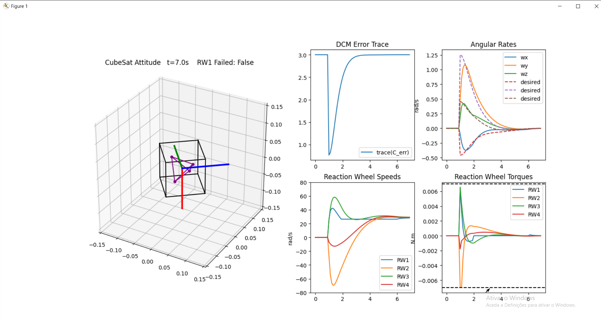

# Spacecraft Attitude Control with Reaction Wheels

A comprehensive simulation of CubeSat attitude control using a pyramid configuration of reaction wheels. This project demonstrates cascaded attitude control, reaction wheel saturation handling, and fault tolerance.

 

[Watch the demo video](media/cubesat_sim.mp4)

## 🚀 Features

- **Quaternion-based attitude representation** for singularity-free orientation tracking
- **Cascaded attitude controller** with outer loop (quaternion error → rate command) and inner loop (rate tracking)
- **Pyramid reaction wheel configuration** providing full 3-axis control with redundancy
- **Reaction wheel saturation handling** with speed and torque limits
- **Fault tolerance simulation** demonstrating control performance during wheel failure
- **Real-time 3D visualization** with animated CubeSat orientation and telemetry plots
- **Modular code architecture** for easy modification and extension

## 📋 Requirements

```bash
numpy
matplotlib
```

Install dependencies:
```bash
pip install numpy matplotlib
```

## 🏗️ Project Structure

```
REACTION_WHEELS/
├── config.py                      # Configuration parameters and constants
├── math_functions.py              # Quaternion and mathematical operations
├── dynamics.py                    # Spacecraft rigid-body dynamics
├── reaction_wheels.py             # Reaction wheel functions and updates
├── util_functions.py              # Utility functions (ramp generators)
├── plot_functions.py              # Visualization and animation functions
├── main.py                        # Main simulation script
├── main_without_refactoring.py   # Original monolithic code (backup)
└── README.md                      # This file
```

### Module Descriptions

#### `config.py`
Configuration file containing all simulation parameters:
- Physical parameters (mass, dimensions, inertia)
- Reaction wheel limits (torque, speed)
- Controller parameters (settling time, damping)
- Simulation settings (time step, duration)
- Desired attitude (Euler angles)

#### `math_functions.py`
Core mathematical operations:
- `euler_to_quat()` - Convert Euler angles to quaternion
- `quat_mult()`, `quat_conj()`, `quat_norm()` - Quaternion algebra
- `quat_to_dcm()` - Quaternion to direction cosine matrix
- `dcm_to_rotvec()` - Extract rotation vector from DCM
- `skew()` - Create skew-symmetric matrix
- `cascaded_attitude_controller()` - Main control law

#### `dynamics.py`
Spacecraft dynamics and integration:
- `dynamics()` - Rigid-body dynamics with quaternion kinematics
- `rk4()` - 4th order Runge-Kutta integrator

#### `reaction_wheels.py`
Reaction wheel specific functions:
- `addAlignmentErrors()` - Simulate wheel misalignment
- `update_reaction_wheels()` - Update wheel speeds with saturation logic

#### `util_functions.py`
Utility functions for trajectory generation:
- `ramp_wd_per_axis()` - Sinusoidal ramp for angular rates
- `wd_linear_ramp()` - Linear ramp for angular rates

#### `plot_functions.py`
Visualization and animation:
- `setup_figure()` - Create figure layout
- `create_animation_update_function()` - Generate animation update function
- `plot_rw()`, `plot_rw_pyramid()` - Reaction wheel visualization

## 🎮 Usage

### Basic Simulation

Run the main simulation:
```bash
python3 main.py
```

This will:
1. Initialize a CubeSat with 4 reaction wheels in pyramid configuration
2. Command a large angle maneuver (20° roll, 90° pitch, 60° yaw)
3. Simulate a reaction wheel failure from t=2s to t=6s
4. Display real-time animation with telemetry plots

### Customizing the Simulation

Edit `config.py` to modify simulation parameters:

```python
# Change desired attitude
ROLL_DESIRED = np.deg2rad(45)
PITCH_DESIRED = np.deg2rad(30)
YAW_DESIRED = np.deg2rad(60)

# Adjust simulation duration
T_TOTAL = 15  # seconds

# Modify controller parameters
T_SETTLE = 8.0  # settling time
ZETA = 0.707    # damping ratio

# Change wheel limits
TAU_MAX = 0.01   # maximum torque [N·m]
W_RW_MAX = 1000  # maximum speed [rad/s]
```

## 📊 Simulation Outputs

The simulation displays a multi-panel visualization:

1. **3D Animation** (left panel)
   - CubeSat orientation with body axes
   - Reaction wheel pyramid configuration
   - Reference frame (desired attitude)

2. **DCM Trace Error** (top middle)
   - Tracks attitude error convergence
   - trace(C_err) → 3 as attitude converges

3. **Angular Rates** (top right)
   - Body angular velocities (ωx, ωy, ωz)
   - Commanded rates (dashed)

4. **Reaction Wheel Speeds** (bottom middle)
   - Individual wheel speeds for all 4 wheels
   - Saturation limits shown as dashed lines

5. **Reaction Wheel Torques** (bottom right)
   - Commanded torques for each wheel
   - Torque limits shown as dashed lines

## 🎯 Control Architecture

### Cascaded Controller

The attitude controller uses a cascaded structure:

1. **Outer Loop**: Quaternion Error → Angular Rate Command
   ```
   ω_cmd = k_q * q_err_vec
   ```
   with rate saturation

2. **Inner Loop**: Rate Error → Torque Command
   ```
   τ = -K_ω * (ω - ω_cmd)
   ```

### Reaction Wheel Distribution

Torques are distributed to 4 reaction wheels using pseudo-inverse:
```
τ_rw = pinv(RW_axes) * τ_cmd
```

Pyramid configuration axes:
```
RW1: [1,  1,  1] / √3
RW2: [1, -1, -1] / √3
RW3: [-1, 1, -1] / √3
RW4: [-1,-1,  1] / √3
```

## 🔧 Advanced Features

### Reaction Wheel Saturation

The simulation includes realistic wheel saturation:
- **Speed saturation**: Wheels cannot exceed maximum RPM
- **Torque saturation**: Individual wheel torques are limited
- **Saturation logic**: When saturated, no acceleration torque is applied

### Fault Tolerance

By default, RW #1 fails from t=2s to t=6s:
- Controller continues operating with 3 remaining wheels
- Demonstrates pyramid configuration redundancy
- Modify in `main.py` to simulate different failure scenarios

### Alignment Errors

Reaction wheel axes include realistic misalignment:
- 10° random perturbation applied to each wheel axis
- Simulates manufacturing and installation tolerances
- Seed is fixed for reproducibility

## 📈 Performance Metrics

Typical performance with default parameters:
- **Settling time**: ~6 seconds for 90° maneuver
- **Overshoot**: Minimal (<5%) with critical damping
- **Steady-state error**: <0.1° 
- **Fault recovery**: Maintains stability during single wheel failure

## 🔬 Technical Details

### State Vector
```
x = [q0, q1, q2, q3, ωx, ωy, ωz]
```
- Quaternion (q0, q1, q2, q3) represents attitude
- Angular velocity (ωx, ωy, ωz) in body frame

### Dynamics
Euler's equation with quaternion kinematics:
```
ω̇ = I⁻¹ * (τ - ω × Iω)
q̇ = 0.5 * Ω(ω) * q
```

### Integration
4th order Runge-Kutta (RK4) with fixed time step of 0.1 s.

## 📚 References

- Wie, B. (2008). *Space Vehicle Dynamics and Control*. AIAA.
- Markley, F. L., & Crassidis, J. L. (2014). *Fundamentals of Spacecraft Attitude Determination and Control*. Springer.
- Sidi, M. J. (1997). *Spacecraft Dynamics and Control: A Practical Engineering Approach*. Cambridge University Press.

**Note**: This is a simulation tool for educational purposes. Real spacecraft systems require additional considerations including:
- Sensor noise and dynamics
- Actuator dynamics and delays
- Environmental disturbances (gravity gradient, magnetic, aerodynamic, solar radiation)
- Power and thermal constraints
- On-board computational limitations
